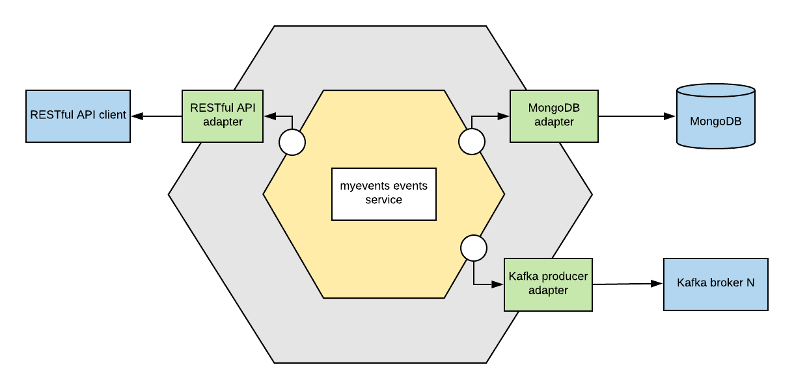

# [MyEvents](https://github.com/danielpacak/myevents) :: Events Service

[](https://travis-ci.org/danielpacak/myevents-events-service)
[](https://codecov.io/gh/danielpacak/myevents-events-service)

The events service handles the events, their locations, and changes that happen to them.
It's part of the [MyEvents](https://github.com/danielpacak/myevents) application.

## Architecture



## Configuration

| Name                                | Default Value         | Description            |
|-------------------------------------|-----------------------|------------------------|
| `EVENTS_SVC_MONGODB_CONNECTION_URL` | `mongodb://127.0.0.1` | MongoDB connection URL |
| `EVENTS_SVC_MONGODB_DATABASE_NAME`  | `events-svc`          | MongoDB database name  |
| `EVENTS_SVC_KAFKA_BROKERS`          | `localhost:9092`      | ? |
| `EVENTS_SVC_OUTBOUND_TOPIC`         | `myevents.events`     | ? |
| `EVENTS_SVC_REST_API_TCP_ADDRESS`   | `:8181`               | ? |
| `EVENTS_SVC_METRICS_TCP_ADDRESS`    | `:9100`               | ? |

## Building and running

1. Download the source code:
   ```
   $ go get https://github.com/danielpacak/myevents-event-service.git
   $ cd $GOPATH/src/github.com/danielpacak/myevents-event-service
   ```
2. Build executable:
   ```
   $ GOOS=linux go build
   ```
3. Start the backing services:
   ```
   $ docker-compose up -d
   ```
4. Create a sample event with curl:
   ```
   $ curl --header "Content-Type: application/json" \
     --request POST \
     --data '{"name": "Some event"}' \
     http://localhost:8181/events
   ```
5. Navigate to Mongo Express at [http://localhost:8081](http://localhost:8081) and make sure
   that the corresponding document was created in events collection.
6. Navigate to Control Center at [http://localhost:9021](http://localhost:9021) and make sure
   that the corresponding message was published to the outbound topic.

## References

1. [Writing a Go client for your RESTful API](https://medium.com/@marcus.olsson/writing-a-go-client-for-your-restful-api-c193a2f4998c)
2. [Functional options for friendly APIs](https://dave.cheney.net/2014/10/17/functional-options-for-friendly-apis)
3. [GopherCon 2018: Kat Zien - How Do You Structure Your Go Apps](https://www.youtube.com/watch?v=oL6JBUk6tj0)
4. [Integration Test With Database in Golang](https://hackernoon.com/integration-test-with-database-in-golang-355dc123fdc9)
